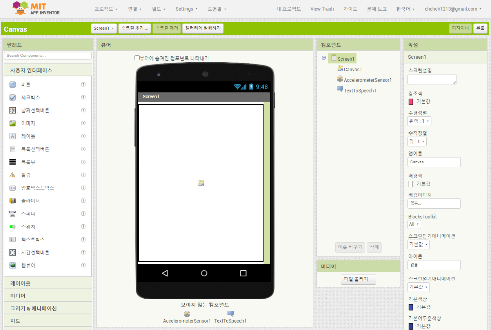
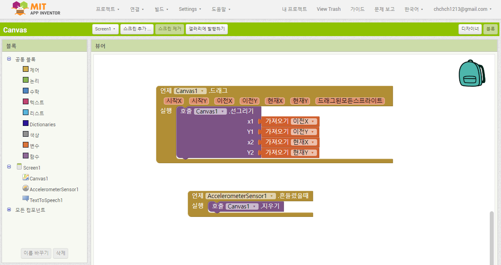
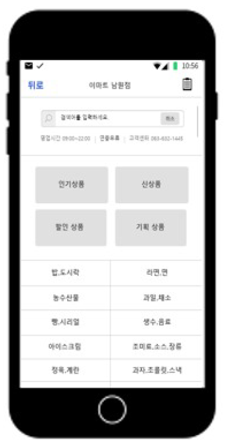

# 😃 소개

### 모맵 포트폴리오를 멘티님께서 발표

- 창고형 대형마트에서 점원이 쉽게 보이지 않다거나 찾고자 하는 물건을 쉽게 찾기위해 서비스 개발 구상
- 카카오 오븐으로 프로토타이핑 설계

> ##### zeplin
>
> 임직원 멘토님께서 카카오 오븐과 같은 프로로타이핑 설계 툴을 소개해주심
> https://zeplin.io

 

### 디자인 씽킹 전문가 피드백 이후 개선점

- 로그인 분리로 소비자와 판매자 권한 분리
- 상품 정보는 판매자가 등록 가능
- 소비자는 매장 정보를 볼 수 있음

> ##### 🤷‍♀️ 소비자에게 어느정도의 정보를 제공할 것인가?
>
> **민강 멘티:** 상품 정보 제공을 위한 카테고리별 분류

  

# 👨🏻‍💼 예선 자료에 대한 멘토님의 피드백

디자인 씽킹 전문가 피드백의 **제안할 점** 에 대한 질문을 멘토님과 멘티님이 서로 묻고 답하기를 함

**Q. 용준 멘토:** 매장 정보를 제공하기 위해 설득해야 하는 사람은 누구인가요? (소비자 or 판매자)
**A. 민강 멘티:** 판매자라고 생각합니다.

**Q. 용준 멘토:** 그럼 판매자에게 설득하기 위해선 어떻게 해야할까요?
**A. 민강 멘티:** 소비자 분들이 매장 내 상품을 쉽게 찾을 수 있게 도와주기 위해 필요합니다.

**Q. 용준 멘토:** 사장의 입장에서는 돈벌고 싶어할 것인데 회사에 이익이 될만한 점이 있을까요?
**A. 민강 멘티:** 직원분을 찾기가 어려운 불편함이 있는 통계자료가 있듯이 이 앱을 통해 그러한 불편한 점을 해결할 수 있을 것 같습니다.

**용준 멘토:** 서비스의 목적이 무엇인지 파악하라.

- 소비자의 관점
- 판매자의 관점

 

> ## 잠깐!
>
> **세부 내용은 읽지 말고** 굵은 글씨부터 훑어 보세요!
> 눈으로 굵은 글씨들을 먼저 읽은 뒤 멘토링때 서로 얘기하고 생각했던 내용을 떠올려 보고 나서 세부 내용을 읽어보시면 문제 해결에 더욱 도움이 될거에요~

 

#### 👀 프로젝트의 목적이 무엇인지 파악하라.

##### 소비자의 관점

소비자는 처음 방문하는 매장이어도 빠르고 쉽게 물건을 찾고 구매하는 것이 관건.
매장에 처음 방문해서 물건이 어디에 있는지도 모르겠고 직원한테 물어보려하니 직원도 잘 안보이거나 일하느라 바쁘시다.
이럴 때 필요한 앱 서비스가 될 수 있다.
 

##### 판매자의 관점

판매자는 상품을 좀 더 많이 판매하고 매장으로 인한 수익 창출을 높이고 싶어 한다.
앱을 통해 상품 안내와 관련된 서비스를 제공하므로 이러한 일들을 하는 직원 수를 줄여 인권비를 절감할 수 있으므로 수익면에서 이익을 보게 된다.
또한 소비자들이 물건을 손쉽고 더 빠르게 구매할 수 있으므로 발길이 닿지 않던 구역에도 필요한 물건을 사러오므로 더 많은 상품을 판매할 수 있다.
 

#### 😮 이미 존재하는 서비스일 경우 차별화를 생각하라.

##### 이미 있는 서비스를 왜 만들려고 하나요?

이케야와 같은 대형 마트에서는 이러한 서비스를 쉽게 제공해 줄 수 있을지 모르지만 동네 마트나 구멍 가게들은 이와 같은 고급 서비스를 쉽게 지원해 줄 수 없습니다.
소상공인 누구든지 예산 걱정 없이 고객이 매장을 훨씬 더 편리하게 사용할 수 있도록 고급 서비스를 제공해줄 수 있도록 하는 것이 이 앱의 궁극적인 목표입니다.
 

##### 창의적이긴 어렵지만 대회 수상과 가까워 지도록

실제 주차장 찾기와 같은 서비스들이 현재 존재하므로 사람들은 이미 있는 서비스라 생각하고 창의적이라는 생각을 하기 어렵게 된다.
여기서 수상과 가까워 지도록 하는 해결 방법은 다음 방법들이 있을 수 있다.

1. 위의 질문을 답과 같이 왜 만들려고 하는지 차별점을 두어 사람들의 불편함을 해소할 수 있도록 더 발전 시키기
2. 주제를 변경하여 재빠르게 프로젝트 재진행

고3이라 현실성 있게 애기하자면 대상에 욕심이 있다면 2번 방식 추천하지만 지금 아이디어도 프로젝트 설계 및 진행만 잘하면 충분히 수상과 가까워 질 수 있고 좋은 프로젝트 이다.
 

# 📐 프로젝트 개발

#### 개발 환경 선택

앱을 개발하기 위해선 어떤 프로그램으로 앱을 개발할 것인지 선택해야 해요!
스케치, 아두이노, C 이런 것들을 앱을 만들기에는 적합한 언어가 아니에요~

안드로이드 앱을 개발하기 위해서는 대표적으로 2가지 프로그램이 있어요.
민강님이 개발 전공을 하시지 않는 이상 굳이 어려운 안드로이드 스튜디오의 길을 걸을 필요는 없어요!

임직원 멘토님과 마찬가지로 대학생 멘토인 저도 앱 인벤터를 추천합니다! :)

 

#### 1. 안드로이드 스튜디오

- `Java` 와 `Kotlin` 이라는 언어를 대표적으로 쓰고 디자인과 동작 방식 모두 코딩으로 설계할 수 있다는 점이 있습니다.
- 블럭 코딩 방식을 지원하지 않습니다.

 

#### 2. 앱 인벤터

- 누구나 손쉽게 안드로이드 앱을 개발할 수 있도록 되어있습니다.
- 블럭 코딩 방식을 지원하며 디자인에 필요한 것들도 왠만큼 전부 있습니다.

  

# 👩🏻‍💻 본선 발표 자료

### 목차

**1. 우리 팀이 해결하고 싶은 문제는 무엇인가요?**
**2. 문제를 해결하기 위해 우리 팀이 제안하는 소프트웨어는 무엇인가요?**
**3. 소프트웨어의 전체 설계 및 구조도를 표현해주세요.**
**4. 현재까지 완성된 프로토타입 또는 작품을 보여주세요. (사진 또는 영상)**
**5. 소프트웨어 기능을 자세히 설명해주세요.**
**6. 소프트웨어를 주변 사람에게 보여주고, 사용한 뒤 어땠는지 물어보세요. 사람들의 의견을 받아 어떻게 달라졌나요?**
**7. 현재 어느 단계까지 구현되었는지, 앞으로 남은 작업은 무엇인지 작성해주세요.**
**8. 향후 구현하면서 기술적으로 예상되는 어려움은 무엇인가요?**
**9. 우리 팀의 소프트웨어로 누구에게, 어떤 긍정적인 변화를 가져올까요?**
  

# 📝 다음 주 목표

- 위 본선 발표 자료를 멘토링을 한것을 바탕으로 생각해보고 작성해 오기
- 카카오 오븐으로 만든 프로토 타입의 **상품 검색하기** 페이지를 **앱 인벤터** 를 사용하여 화면 만들어 보기
  

 

# 🙋🏻‍♀️ 질문 타임

**Q. 민강 멘티:** 서비스를 실제 구현할 수 있을까요?
**A. 용준 멘토:** 앱을 한번도 만들어 보지 않아서 지금 당장은 두려울 수 있지만 이 정도의 수준이면 충분히 가능합니다.
만약 발표 때 어필을 한다면, "이 앱의 기능이 5가지 인데 시간이 부족해서 이 까지 밖에 구현을 못했습니다. 시간이 많았다면 충분히 다 만들 수 있었습니다." 또는 "저는 디자이너라서 개발 지식은 다소 미흡해 디자인이 초점을 두고 제작했습니다." 라고 솔직히 얘기해도 무방해요.

**Q. 민강 멘티:** 앱 서비스 말고 다른 아이디어들을 몇 개 생각을 해본 것들을 제안해봐도 될까요?
**A. 용준 멘토:** 얼마든지 가능하고 주제 변경이 가능한지는 운영사무국과 얘기를 해보면 됩니다.
