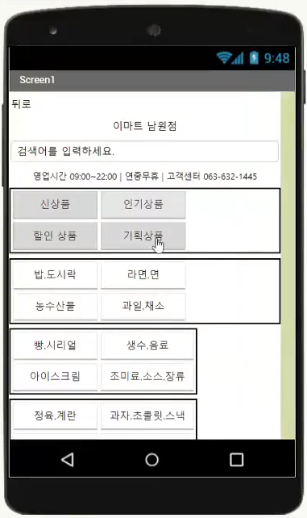
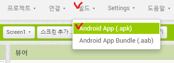
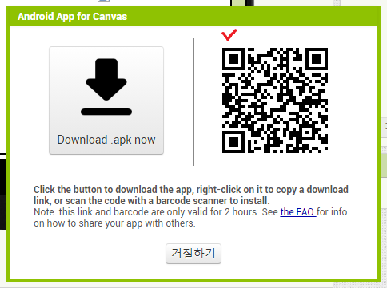

# 👩🏻‍🏫 본선 실행 계획서

### 💡 1. 우리 팀이 해결하고 싶은 문제는 무엇인가요?

### 💬 2. 문제를 해결하기 위해 우리 팀이 제안하는 소프트웨어는 무엇인가요?

두 질문의 답변 모두 예선때 브레인 스토밍으로 제출한 파일을 녹여서 적으면 좋을 것 같습니다.
 

### 📐 3. 소프트웨어의 전체 설계 및 구조도를 표현해주세요.

Flow Chart ? 순서도? 코드 블럭?

아래내용을 녹이면 됩니다!

- 사용하는 언어
- 사용하는 프로그램
- 기능 (내 주변 매장 찾기 기능의 순서도, 시퀀스 다이어그램)
- 데이터베이스 (매장 정보, 상품 정보 등을 담아두는 것)

전체 기능을 먼저 소개해 준 뒤 세부 기능 하나하나를 알려주면 좋을 것 같습니다!

> **공식 (시퀀스 다이어그램)** 을 만든 뒤 **대입 (코드 블럭)을 한다!**

 

### 📝 4. 현재까지 완성된 프로토타입 또는 작품을 보여주세요. (사진 또는 영상)

앱 인벤터로 만든 뒤 실행 화면 UI/UX 디자인을 캡쳐하면 좋을 것 같습니다!

> #### 앱 인벤터 실행 방법 1 - 실제 폰
>
> 아래 그림대로 선택 후 QR코드를 휴대폰에서 캡쳐하여 `.apk` 파일을 다운받은 뒤 실행하여 설치하면 됩니다!
>  > 

> #### 앱 인벤터 실행 방법 2 - 가상 폰
>
> 해당 링크에 자세히 설명되어 있습니다!
> 만약 오류가 계속 된다면 프로그램을 삭제후 처음부터 다시 해보세요!
> https://m.blog.naver.com/PostView.naver?isHttpsRedirect=true&blogId=kindpark6142&logNo=221296838412

 

### 🔧 5. 소프트웨어 기능을 자세히 설명해주세요.

브레인 스토밍 pdf 내용을 기반으로 제작된 앱 기능들을 소개하면 될 것 같습니다!

 

### 🧏🏻‍♀️ 6. 소프트웨어를 주변 사람에게 보여주고, 사용한 뒤 어땠는지 물어보세요. 사람들의 의견을 받아 어떻게 달라졌나요?

### ⏳ 7. 현재 어느 단계까지 구현되었는지, 앞으로 남은 작업은 무엇인지 작성해주세요.

### 🤷🏻 8. 향후 구현하면서 기술적으로 예상되는 어려움은 무엇인가요?

### 👩🏻‍🔧 9. 우리 팀의 소프트웨어로 누구에게, 어떤 긍정적인 변화를 가져올까요?

앱이 어느정도 제작된 후 진행되는 부분입니다!

  

# ⚙️ 기능적인 부분

### 🗺️ 자신의 위치를 어떻게 보여줄 것인가?

GPS, WiFi, 모바일 네트워크 등으로 자신의 위치를 측정할 수 있습니다.

건물 내부에서 사용하는 만큼 정확하게 해야하는데 어떻게 해야할지 생각해 보세요!

 
