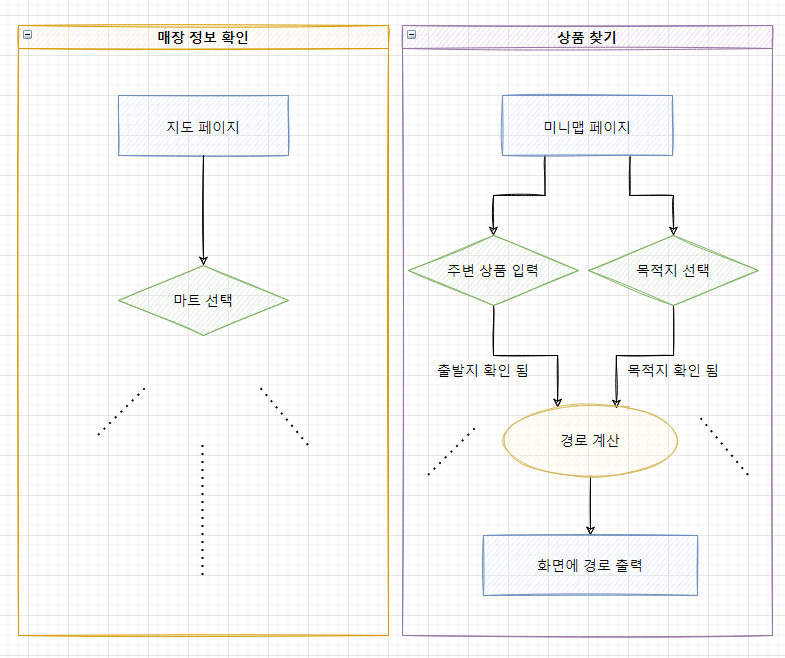
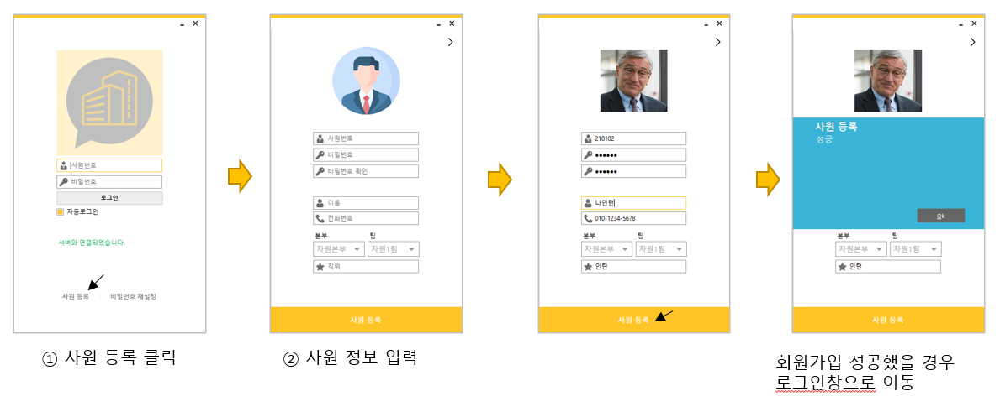

# 🗺️ 실내 위치 탐색

현실적으로 GPS, BLE 와 같은 기술을 적용하기엔 어렵고 힘듭니다.

사용자가 **주변 상품을 입력하면 출발지**인 사용자의 위치를 알 수 있도록 하고 **원하는 상품을 입력하면 도착지**를 알 수 있도록 개발하는 것이 좋은 방법일 것 같습니다!
   

# ✒️ 해야할 것 - ① 순서도 그리기

설계를 먼저 하셔야 합니다!

우선 **앱의 기능들에 대한 순서도**가 나와야 발표자료에도 넣고 실제 프로토타입 개발에도 사용할 수 있습니다.

처음 화면에서 사용자가 어떤 버튼을 누를땐 어떤 동작이 되는지 등등을 넣으시면 됩니다!

순서도를 얼마나 열심히 짯는지에 따라서 **무엇을 어떻게 만들어야할지 고민하는 시간**이 줄어들거에요!

> #### 도움 되는 사이트
>
> **순서도 그리기** https://draw.io
> 쉽고 간단하게 순서도를 짤 수 있어요.
>
> **사이트 사용법** https://www.edrawsoft.com/kr/program-review/how-to-draw-flowchart-in-drawio.html
> 간단한 사용법이 설명되어 있어요!

모맵에는 아래와 같은 여러가지 기능들이 있잖아요!

- 매장 정보 확인
- 체크리스트 작성
- **⭐상품 찾기**
- 상품 정보 확인
- ...

해당 기능들 중에 **현실적으로 개발 가능한 것들**을 뽑아서 각 기능들의 **페이지별로** 순서도를 먼저 짜보세요!

민강님 보기 편하도록 간단하게 짜보았는데 실제로는 **세부적인 기능들, 사용자가 입력하는 것들** 하나하나까지 다 만들어야 합니다!
그러면 발표자료에 넣을때 보기에도 좋고 **빠르게 기능구현을** 할 수 있답니다!
  

# ✒️ 해야할 것 - ② 앱 만들기

순서도를 작성하시면서 무엇을 먼저 만들면 좋을지 생각이 나실거에요.

1. 판매자 로그인 > 상품 등록 > ...
2. 소비자 로그인 > 매장 선택 > 상품 검색 > ...

이와 같이 생각나는 기능대로 **순서도를 보며 개발**하면 됩니다!

#### 판매자

우선 판매자가 상품을 등록할 수 있게 기능을 만들어야 소비자도 상품을 검색할 수 있겠죠?

앱 인벤터의 한계에서 가능한 것은 판매자가 입력한 데이터가 스마트폰 안에 **파일로 저장되는 것**이 좋을 것 같습니다.

이렇게 개발하면 발표 때 `지금은 파일로 내부에 저장되지만 나중에 네트워크 통신을 통해 서버 데이터베이스에 저장해서 실제 사용가능도록 만들 수 있다` 라고 말할 수 있습니다.

서버, 네트워크, 데이터베이스 등 전문 용어가 있어 부담스러울 수 있지만 발표를 위해 검색해서 무엇인지 정도만 파악하면 좋을거에요~!

#### 소비자

매장을 선택하고 나면 파일에서 매장 정보 데이터를 불러온 뒤 상품 검색을 할 수 있도록 짜실거에요~
  

# ✒️ 해야할 것 - ③ 실행계획서 작성

### 💡 1. 우리 팀이 해결하고 싶은 문제는 무엇인가요?

### 💬 2. 문제를 해결하기 위해 우리 팀이 제안하는 소프트웨어는 무엇인가요?

이 부분은 민강님 재량껏 작성 하시면 됩니다!
 

### 📐 3. 소프트웨어의 전체 설계 및 구조도를 표현해주세요.

https://draw.io 사이트에서 그린 순서도를 기능별로 만든 뒤 모두 캡쳐하여 작성해주세요!

한눈에 잘 보일 수 있도록 한페이지에 적당한 개수를 넣으시면 좋습니다~
 

### 📝 4. 현재까지 완성된 프로토타입 또는 작품을 보여주세요. (사진 또는 영상)

만드신 모맵 앱을 실행한 화면을 넣으시면 좋아요!

영상 편집이 가능하시면 `Demo` 작품 발표때 사용하기 좋지만 시간상 영상까지 만들긴 힘들겠죠...? 😅

사진으로 구조를 설명한다면 아래처럼 예시를 들 수 있을 것 같아요~

 

### 🔧 5. 소프트웨어 기능을 자세히 설명해주세요.

모맵에는 어떤 기능들이 있고 어떤 역할을 해주는지 화면 사진과 함께 설명해주면 좋을 것 같아요!

 

### 🧏🏻‍♀️ 6. 소프트웨어를 주변 사람에게 보여주고, 사용한 뒤 어땠는지 물어보세요. 사람들의 의견을 받아 어떻게 달라졌나요?

질문 그대로 하고 답변받은 내용들을 잘 정리해서 적어주세요~

### ⏳ 7. 현재 어느 단계까지 구현되었는지, 앞으로 남은 작업은 무엇인지 작성해주세요.

전에 언급했던 것 처럼 현재는 판매자가 입력한 상품 정보가 파일로 작성되지만 추후 실제 서비싱을 위해 서버를 구축해야한다 등등 앞으로의 모맵에 해야할 것들을 적으시면 될 것 같아요~

### 🤷🏻 8. 향후 구현하면서 기술적으로 예상되는 어려움은 무엇인가요?

개발 경험이 많지 않아 이것을 예상하기엔 힘들 것으로 보여요 이것은 멘토님들과 함께 상의하여 적는것이 좋을 것 같네요!

### 👩🏻‍🔧 9. 우리 팀의 소프트웨어로 누구에게, 어떤 긍정적인 변화를 가져올까요?

파이팅!!
